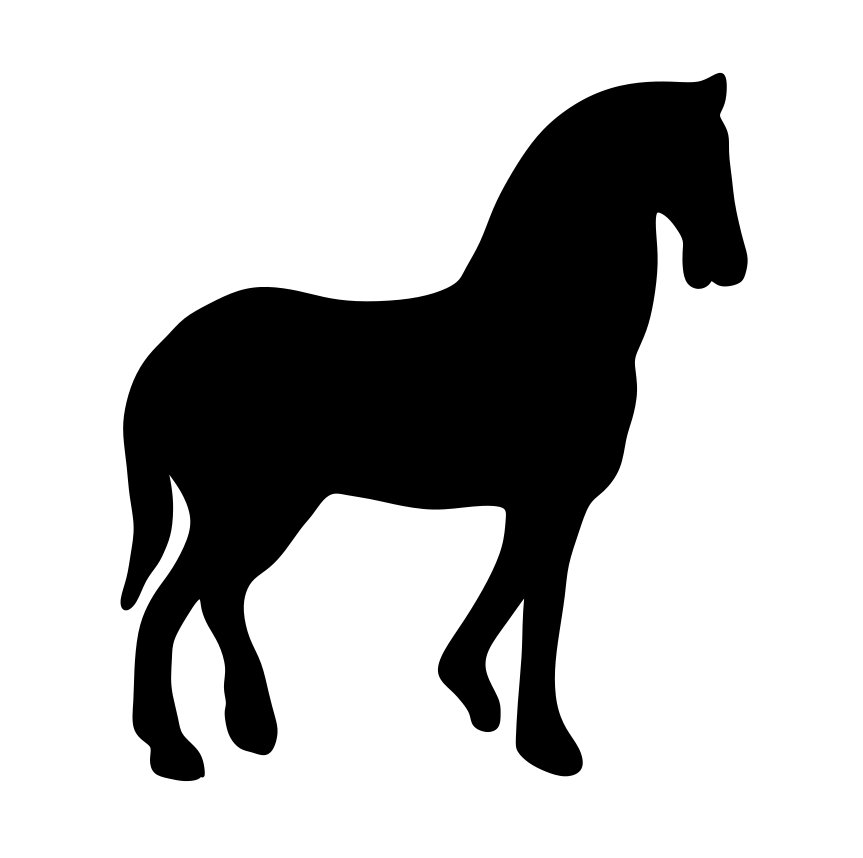
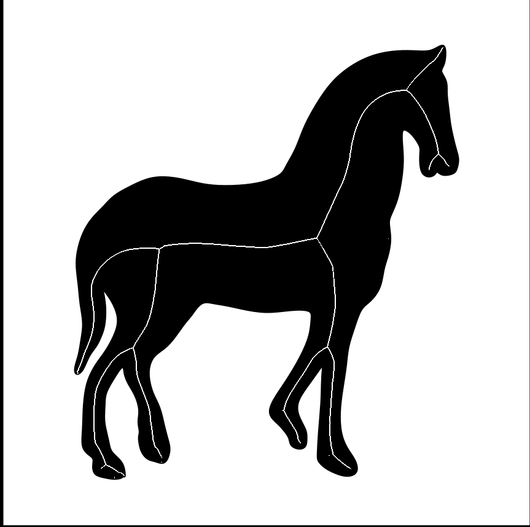
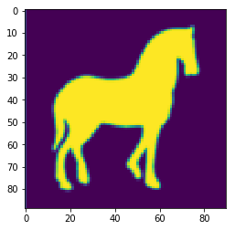
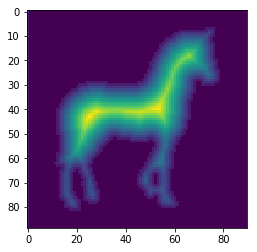
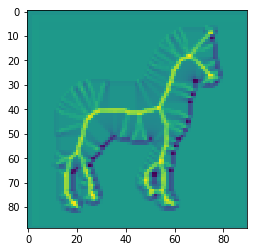
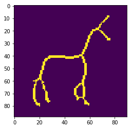

## 2D AOF Skeleton

 

The medial axis, or _topological skeleton_, of an object &Omega; is the set of all points in &Omega; having more than one closest point on the object boundary, &part;&Omega;. This repository contains matlab code for computing the medial axis of binary images.

A binary image is one with only two pixel values or colors. This code (and all examples) use the convention that the two image colors are black and white, with pixel values 0 and 1 respectively.


This is a step by step jupyter notebook for 2D AOF Skeletonization code


Step 1 : import some tools
```python
import matplotlib.pyplot as plt
from scipy.misc import imresize
import matplotlib.image as mpimg
import math
import numpy as np
```

Step 2: Create a function to convert RGB images to Grayscale
```python
def rgb2gray(rgb):
    return np.dot(rgb[...,:3], [0.2989, 0.5870, 0.1140])
```

Step3: Specify your file name!
```python
fileName = "horse.png"
```

Step 4: Read the image
```python
I=mpimg.imread(fileName)
```


Step 5: Convert the image to grayscale and invert it to consider the black area for skeletonization process.
```python
I = rgb2gray(I)
I = 1-I
I = imresize(I,0.3)
print(I.shape)
```

    (89, 90)


```python
imgplot = plt.imshow(I)
```





```python
plt.show()
```

Step 6: Define the tuning parameters. Number of samples is related to the number of points this algorithm considers around a shrinking disk.
```python
number_of_samples = 60
epsilon = 1 
flux_threshold = 18

```


```python
import scipy.ndimage.morphology as morphOps
```

Step 7: Compute the distance transform

```python
distImage,IDX = morphOps.distance_transform_edt(I,return_indices=True);
```


```python
plt.imshow(distImage)
```


    <matplotlib.image.AxesImage at 0xb24fc0d30>





Step 8: Sample a set of points around a shrinking disk 
```python
def sample_sphere_2D(number_of_samples):
    sphere_points = np.zeros((number_of_samples,2))
    alpha = (2*math.pi)/(number_of_samples)
    for i in range(number_of_samples):
        sphere_points[i][0] = math.cos(alpha*(i-1))
        sphere_points[i][1] = math.sin(alpha*(i-1))
    return sphere_points
```


```python
print(number_of_samples)
```

    60


```python
sphere_points = sample_sphere_2D(number_of_samples)
```


```python
def sub2ind(array_shape, rows, cols):
    ind = rows*array_shape[1] + cols
    ind[ind < 0] = -1
    ind[ind >= array_shape[0]*array_shape[1]] = -1
    return ind

def ind2sub(array_shape, ind):
    ind[ind < 0] = -1
    ind[ind >= array_shape[0]*array_shape[1]] = -1
    rows = (ind.astype('int') / array_shape[1])
    cols = ind % array_shape[1]
    return (rows, cols)
```

Step 9: This is the main step, where at each point, we compute the flux value that goes through a shrinking disk around a considered point. 
```python
def compute_aof(distImage ,IDX,sphere_points,epsilon):

    m = distImage.shape[0]
    n = distImage.shape[1]
    normals = np.zeros(sphere_points.shape)
    fluxImage = np.zeros((m,n))
    for t in range(0,number_of_samples):
        normals[t] = sphere_points[t]
    sphere_points = sphere_points * epsilon
    
    XInds = IDX[0]
    YInds = IDX[1]
    
    for i in range(0,m):
        for j in range(0,n):       
            flux_value = 0
            if (distImage[i][j] > -1.5):
                if( i > epsilon and j > epsilon and i < m - epsilon and j < n - epsilon ):
#                   sum over dot product of normal and the gradient vector field (q-dot)
                    for ind in range (0,number_of_samples):
                                                
#                       a point on the sphere
                        px = i+sphere_points[ind][0]+0.5;
                        py = j+sphere_points[ind][1]+0.5;
                        
                        
                        
                        
#                       the indices of the grid cell that sphere points fall into 
                        cI = math.floor(i+sphere_points[ind][0]+0.5)
                        cJ = math.floor(j+sphere_points[ind][1]+0.5)
                                               

#                       closest point on the boundary to that sphere point

                        bx = XInds[cI][cJ]
                        by = YInds[cI][cJ]
#                       the vector connect them
                        qq = [bx-px,by-py]
                    
                        d = np.linalg.norm(qq)
                        if(d!=0):
                            qq = qq / d
                        else:
                            qq = [0,0]                        
                        flux_value = flux_value + np.dot(qq,normals[ind])
            fluxImage[i][j] = flux_value  
    return fluxImage
```


```python
fluxImage = compute_aof(distImage,IDX,sphere_points,epsilon)
```

```python
print(fluxImage.shape)
```

    (89, 90)


```python
plt.imshow(fluxImage)
```


    <matplotlib.image.AxesImage at 0x11dda9438>




Step 10: Simply threshold the image by a value and get the skeleton. 

```python
skeletonImage = fluxImage
skeletonImage[fluxImage < flux_threshold] = 0
skeletonImage[fluxImage > flux_threshold] = 1

```


```python
plt.imshow(skeletonImage)
```


    <matplotlib.image.AxesImage at 0x11de47b00>





```python

```

## Updating
Assuming you have not made any local changes to these files, you can update your local code to the newest version with [git pull](https://git-scm.com/docs/git-pull).
Open a terminal, navigate to your `2D AOF Skeleton/` folder, and run
```
git pull
```

If you have edited any files, `git pull` may throw errors. You can update while keeping your local changes by running:
```
git stash
git pull
git stash pop
```

If you are new to git, you can learn more about it [here](https://git-scm.com/doc)
<br>
<br>

## References
If you use the AOF Skeleton package, we appreciate it if you cite the following papers:

```
@incollection{rezanejad2013flux,
  title={Flux graphs for 2D shape analysis},
  author={Rezanejad, Morteza and Siddiqi, Kaleem},
  booktitle={Shape Perception in Human and Computer Vision},
  pages={41--54},
  year={2013},
  publisher={Springer}
}
@inproceedings{dimitrov2003flux,
  title={Flux invariants for shape},
  author={Dimitrov, Pavel and Damon, James N and Siddiqi, Kaleem},
  booktitle={Computer Vision and Pattern Recognition, 2003. Proceedings. 2003 IEEE Computer Society Conference on},
  volume={1},
  pages={I--I},
  year={2003},
  organization={IEEE}
}
@article{Siddiqi:2002:HS:598432.598510,
 author = {Siddiqi, Kaleem and Bouix, Sylvain and Tannenbaum, Allen and Zucker, Steven W.},
 title = {Hamilton-Jacobi Skeletons},
 journal = {Int. J. Comput. Vision},
 issue_date = {July-August 2002},
 volume = {48},
 number = {3},
 month = jul,
 year = {2002},
 issn = {0920-5691},
 pages = {215--231},
 numpages = {17},
 url = {https://doi.org/10.1023/A:1016376116653},
 doi = {10.1023/A:1016376116653},
 acmid = {598510},
 publisher = {Kluwer Academic Publishers},
 address = {Norwell, MA, USA},
 keywords = {2D and 3D skeletons, Hamiltonian systems, eikonal equation, flux and divergence, shape analysis},
} 
```

## Contact
For any question regarding this package, please contact morteza@cim.mcgill.ca

## License
This program is free software: you can redistribute it and/or modify
it under the terms of the GNU General Public License as published by
the Free Software Foundation, either version 3 of the License, or
(at your option) any later version.

This program is distributed in the hope that it will be useful,
but WITHOUT ANY WARRANTY; without even the implied warranty of
MERCHANTABILITY or FITNESS FOR A PARTICULAR PURPOSE.  See the
GNU General Public License for more details.

You should have received a copy of the GNU General Public License
along with this program.  If not, see <https://www.gnu.org/licenses/>.
